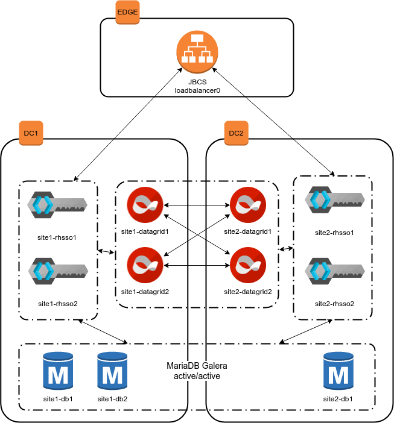

# cross-dc-rhsso-demo

Cross-Datacenter Replication mode lets you run Red Hat Single Sign-On in a cluster across multiple data centers, most typically using data center sites that are in different geographic regions. When using this mode, each data center will have its own cluster of Red Hat Single Sign-On servers.

This repository contains a reference configuration which can deploy two clusters of RH SSO instances, backed by a distributed bi-partitioned cluster of RH Datagrid instances.
For the sake of the demo, it also contains playbooks to deploy a loadbalancer (JBCS) in front of the scenario, and a highly-available database (mariadb with galera) on the backend.
Both RHSSO and RHDATAGRID clusters use jgroups JDBC_PING to advertise to each other; while RHSSO advertise to JBSC using mod_cluster.

The final architecture looks like:




## Prerequisites

* rhel 8.4 with registered subscription
* ansible 2.9 / python 3.9
* `ansible-galaxy collection install -r collections/requirements.yml`
* a minimum of 9 (or possibly 12) instances for the whole production-like scenario

## Run in podman

The `test/` directory contains a Containerfile definition and a shell script to execute the full CrossDC scenario on podman containers.

Only requirements for running in podman are: a resonable amount of system memory ( >= 8GB ), being able to run rootful containers, and dnsname plugin being available for podman external-networks.

#### Steps

1. Create the three networks for the scenario
```
$ podman network create site1
$ podman network create site2
$ podman network create loadbalancer
```

Make sure you get the following when inspecting the networks:
```
{ "capabilities": { "aliases": true }, "domainName": "dns.podman", "type": "dnsname" }
```

2. Create a var-file containing your RHN credentials:
```
$ cat rhn-creds.yml
rhn_username: '<username>'
rhn_password: '<password>'
```

3. Run the podman.sh script:
```
cd test/
./podman.sh
```

## Run on baremetal/virtualized/cloud

1. Prepare your resources so that:
  - you have three bridged networks/vpcs; refer to the firewall configuration in the playbooks for security-group configuration
  - you have one instance on the first network (loadbalancer0), 6 and 5 instances on the other networks (site1 and site2 nodes); this can be reduced to 4 and 4 by aliasing the RHSSO nodes with the mariadb database nodes.
  - name resolution across the networks works

2. Create a var-file containing your RHN credentials:
```
$ cat rhn-creds.yml
rhn_username: '<username>'
rhn_password: '<password>'
```

3. Execute the main play:
```
ansible-playbook -e @rhn-creds.yml -i scenario playbooks/all.yml
```

## Security considerations

* By default the playbook deploys self-signed certificates everywhere
* sso/datagrid communication is via non-tls hotrod protocol, and CRAM-MD5 authentication

## License

## Authors